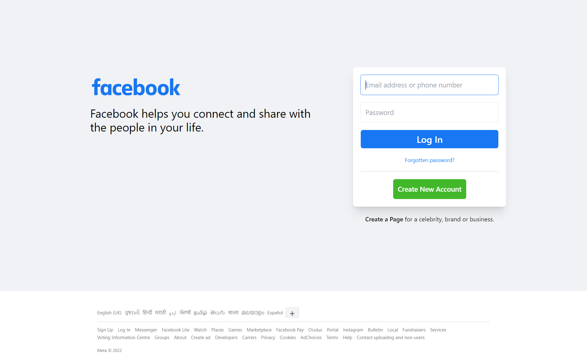

# Facebook Login Clone

A login page clone of Facebook using powers of Tailwind 🚀

## Demo

https://facebook-login-clone-kuldp.netlify.app/

## Screenshots

Original:


My Version:



## Tech Stack

**Client:** TailwindCSS

## Run Locally

Clone the project

```bash
  git clone https://github.com/kuldp18/facebook-login-clone.git
```

Go to the project directory

```bash
  cd facebook-login-clone
```

Install dependencies

```bash
  npm install
```

Start the server

```bash
  npm run dev
```

Start watching the css

```bash
  npm run css-watcher
```

## Deployment

To generate build run

```bash
  npm run build
```

and check ./dist
